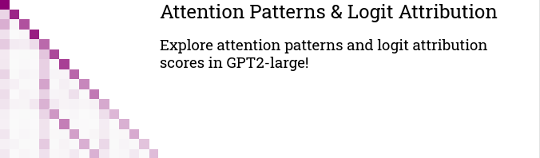

.. _interfaces:

====================
Interfaces in Unseal
====================

.. contents:: Contents

Unseal wants to provide simple and intuitive interfaces for exploring
large language models.

At its core it relies on a combination of Streamlit and PySvelte.

Notebooks
==========

Here we collect Google Colab Notebooks that demonstrate Unseal functionalities.

Streamlit interfaces
====================

Unseal comes with several native interfaces that are ready to use out of the box.

All the pre-built interfaces are available in the ``unseal.interface.streamlit_interfaces`` package.

To run any of the interfaces, you can navigate to the ``streamlit_interfaces`` directory and run

.. code-block:: bash

    streamlit run <interface_script>

